# Urban Flow

Welcome to Urban Flow – a dynamic and user-friendly Django-based e-commerce platform tailored to urban fashion enthusiasts. Our project aims to streamline the process of discovering, purchasing, and learning about the latest trends in urban clothing and footwear. With a sleek, modern interface and robust back-end functionality, Urban Flow provides a seamless shopping experience for both trendsetters and fashion aficionados.

## Table of Contents:
1. UX-Design
    - Planning 
        - Agile approach
        - User Stories
    - WireFrames
    - Fonts
    - Colours

2. Database Schema
    - ERD

3. Features
    - Existing Features

4. Technologies Used
    - Languages, libraries and frameworks
    - Tools

5. Testing
    - Manual Testing
    - Code Validation

6. Deployment
    - Heroku

7. SEO
    - Sitemap
    - Robots.txt

8. Buisness Model

## UX-Design
Urban Flow delivers an intuitive and engaging shopping experience for urban fashion enthusiasts. Upon landing on the homepage, users are greeted with a sleek, modern interface that reflects the dynamic nature of urban culture. The navigation is straightforward, allowing users to effortlessly browse through a collection of clothing and footwear.

### Planning

- Agile approach:
Adopted an Agile approach to manage the project efficiently. This methodology allows for iterative development, continuous feedback, and flexibility to adapt to changes. By breaking the project into smaller, manageable tasks, we can deliver incremental improvements and ensure a high-quality end product.

- User Stories: 
User stories are a key component of our Agile approach. They describe the features and functionalities from the user's perspective, ensuring that the project meets the users' needs. Each user story includes acceptance criteria to define the conditions for successful implementation. This helps in maintaining a user-centric focus throughout the development process.

- WireFrames
    - Home page
    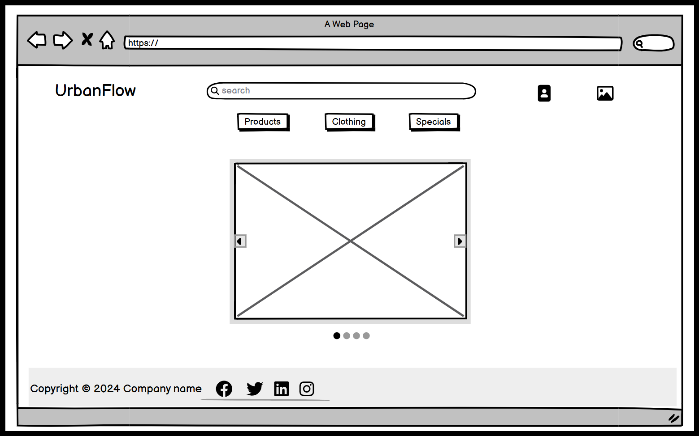

    - Products page
    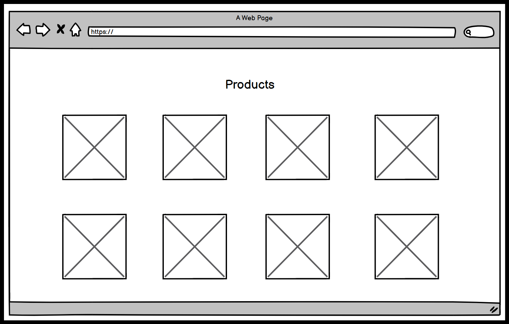

    - Product detail page
    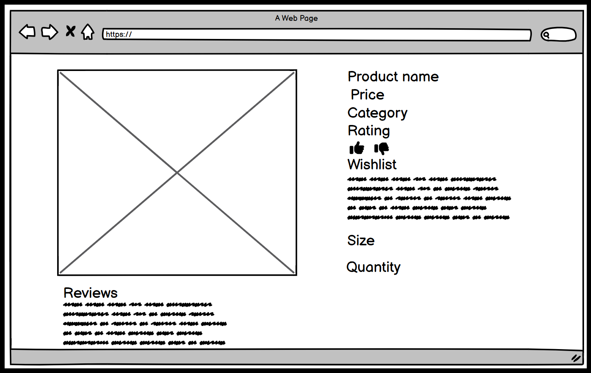

    - Profile page
    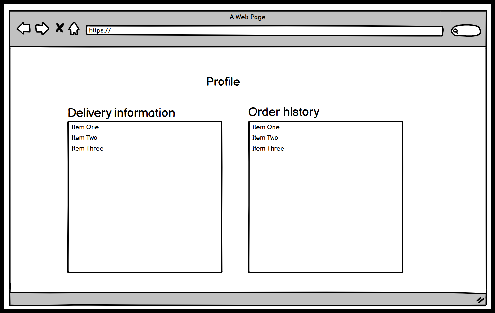

- Fonts

Urban Flow uses the Oswald font to provide a modern and clean aesthetic that complements the contemporary urban fashion showcased on the site. The Oswald font is known for its readability and style, enhancing the overall user experience by ensuring that all text elements are both visually appealing and easy to read.

- Colours

The color palette for Urban Flow consists of black, white, orange, and blue, creating a vibrant and dynamic visual identity. Each color plays a specific role in the design:

Black: Used for the background, providing a sleek and elegant contrast.

White: Serves as the primary colour for forms and tables, ensuring clarity and readability.

Orange: Accentuates call-to-action buttons and highlights, adding energy and a sense of urgency.

Blue: Adds a touch of cool sophistication and is used for links and interactive elements to guide user interactions.

Together, these colors create a cohesive and engaging visual experience that reflects the urban, stylish nature of the platform.

## Database

- Schema
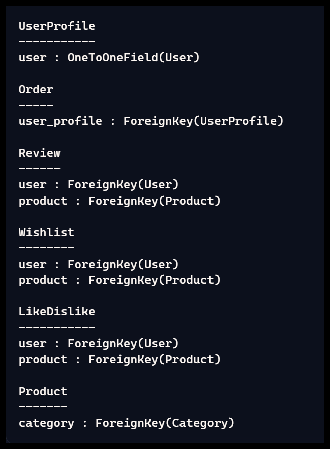

## Features

### Existing features
    
- Header

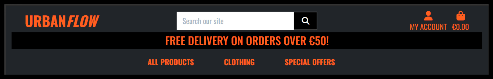

- Footer

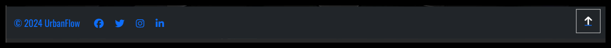

- User dropdown
    
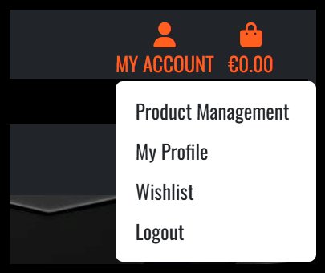

- Shopping bag

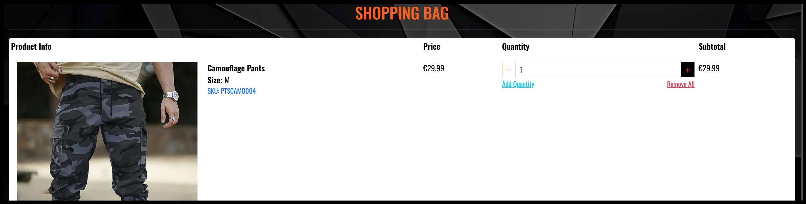

- Checkout

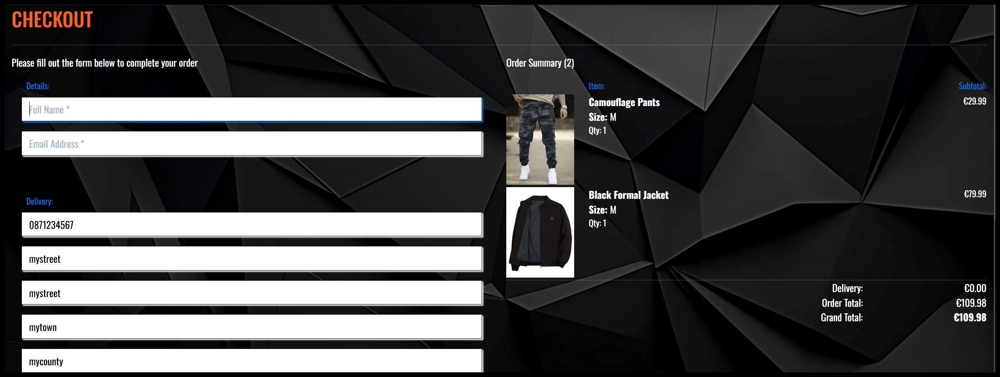

- Product management

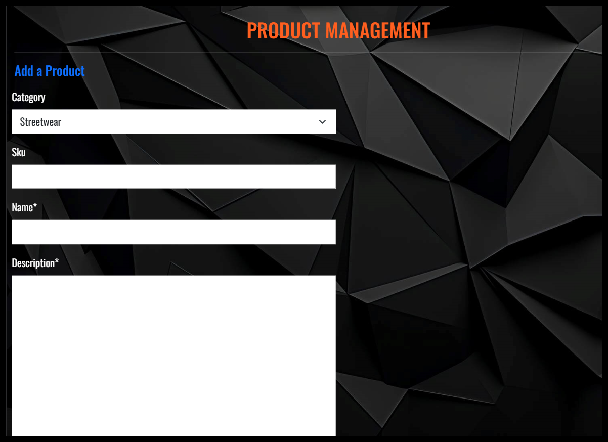

- Wishlist

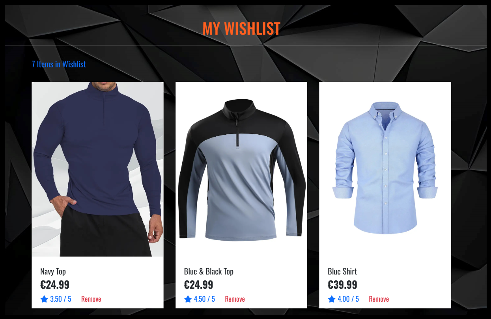

- Profile

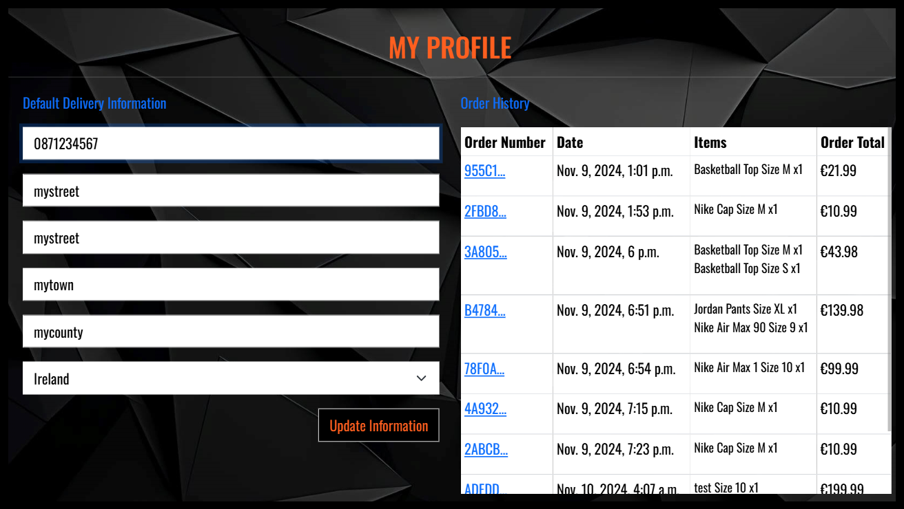

 - Reviews

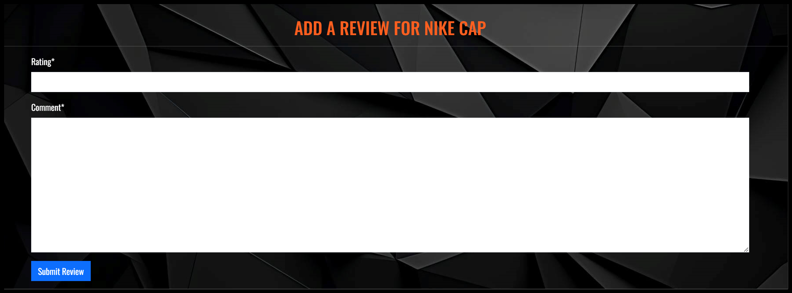

## Technologies Used

Urban Flow is built using a robust and modern tech stack to ensure a seamless and efficient e-commerce experience. The main technologies used in this project are:

HTML: Provides the structure of the web pages, ensuring that content is well-organized and accessible.

CSS: Styles the HTML elements to create a visually appealing layout and enhance user experience.

JavaScript: Adds interactivity and dynamic content to the website, enabling a smooth and responsive user interface.

Bootstrap 5: A powerful front-end framework that simplifies the design process with pre-built components and responsive layout options.

Python: The core programming language used for developing the back-end logic, ensuring efficient and maintainable code.

Django: A high-level Python web framework that promotes rapid development and clean, pragmatic design, enabling robust back-end functionality and secure web applications.

By leveraging these technologies, Urban Flow delivers a modern, dynamic, and user-friendly e-commerce platform tailored to the needs of urban fashion enthusiasts.

### Tools

Github for version control and storing the projects code.

PostgreSQL was used for its relational database management system.

AWS for serving static files.

Balsamiq for design wireframes.

## Testing

### Manual Testing

|Feature:|Expected Outcome:| Actual Outcome:|
|--------|-----------------|----------------|
|User Registration|Users should be able to register with a valid email and password|Users can register successfully|
|Verify Registration|Users should recieve a verification email for registration|Users recieve a verification email to verify email|
|User Login|Registered users should be able to log in with their credentials|Registered users can log in successfully|
|User Logout|Logged in users should be able to log out successfully|Logged in users can logout successfully|
|Product Page Access|Non-logged-in users should be able to browse the product page|Non-logged-in users can browse the product page|
|Product Detail Access|Non-logged-in users should be prompted to sign in when accessing product details|Non-logged-in users are prompted to sign in when accessing product details|
|Add to Shopping Bag|Logged-in users should be able to add products to their shopping bag|Logged-in users can add products to their shopping bag successfully|
|Checkout Process|Users should be able to complete the checkout process successfully|Users can successfully complete the checkout process|
|Payment Processing|Users should be able to complete payments securely|Users can complete payments securely|
|Checkout Success Confirmation|After a successful checkout the user should recieve a confirmation email|Users recieve confirmation emails after successful checkout|
|Admin Page Access|Non-admin users should be restricted from accessing the admin page|Non-admin users are restricted from accessing the admin page|
|Admin Dashboard Access|Admin users should be able to access the admin dashboard|Admin users can access the admin dashboard successfully|
|Adding Products|Admin users should be able to add new products|Admin users can add new products|
|Editing Products|Admin users should be able to edit products|Admin users can edit products|
|Deleting Products|Admin users should be able to delete products|Admin users can delete products|
|Manage Users|Admin users should be able to manage all users accounts|Admin users can manage all users accounts|
|Order Management|Admin users should be able to manage all orders|Admin users can manage orders successfully|
|Order History|Logged-in users should be able to view their order history|Logged-in users can view their order history successfully|
|Profile Update|Users should be able to update their profile information|Users can update their profile information successfully|
|Wishlist|Users should be able to add and remove products from their wishlist|Users can add and remove products from their wishlist successfully|
|Like Feature|Users should be able to like products|Users can like products successfully|
|Dislike Feature|Users should be able to dislike products|Users can dislike products successfully|
|Product Reviews|Users should be able to leave reviews for products|Users can leave reviews for products successfully|
|Product Sizes|Users should be able to select different sizes for products|Users can select different sizes for products successfully|
|Product Quantity|Users should be able to select the quantity of products they want to purchase|Users can select the quantity of products they want to purchase successfully|
|Product Filtering|Users should be able to filter products based on categories, price, etc.|Users can filter products successfully|
|Search Functionality|Users should be able to search for products using keywords|Users can search for products using keywords|
|Newsletter Subscription|Users should be able to subscribe to a newsletter with their prefilled email|Users can subscribe to a newsletter with their prefilled email|
|Responsive Design|The website should be responsive and work well on different screen sizes|The website is responsive and works well on different screen sizes|
|Error Handling|The application should handle form errors and display appropriate error messages|The application handles errors and displays appropriate error messages|
|Password Reset|Users should be able to reset their passwords if they forget them|Users can reset their passwords successfully|

### Code validation

W3C HTML validation service does not highlight any major errors in the HTML templates.

CSS passes through W3C validation service.
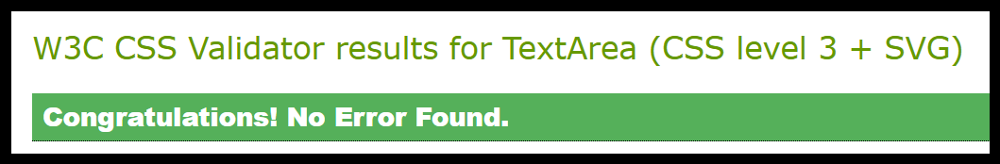

JavaScript code passes through JSHint with no major errors.

Python code passes through the code institute linter validator.

## Deployment

Heroku was used to deploy the site, Heroku is a cloud platform as a service (PaaS) that enables developers to build, run, and operate applications entirely in the cloud. It supports several programming languages, including Python. Heroku simplifies the deployment process by providing a platform where you can easily manage your application's infrastructure, scaling, and monitoring without needing to worry about server management. I connected my app on Heroku to my repository on Github, configured environment variables in the Config Vars section and created a Procfile. I set up AWS for serving static files and installed the required packages boto3 and django-storages then updated my settings file for deployment. Automatic deploys was set up on Heroku so every time I made a change to the code in Github, committed and pushed the files the change would take effect on the deployed site.

## SEO

### Sitemap

To enhance the SEO of Urban Flow e-commerce website, creating a sitemap is essential. This will help search engines better index the site and improve its visibility in search results.

### Robots

The robots.txt file is used to manage and control the behavior of search engine crawlers. It helps prevent certain parts of a website from being indexed, ensuring that only relevant content is visible in search engine results.

## Buisness Model

### Facebook page

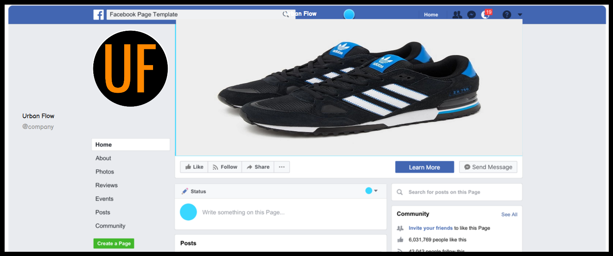
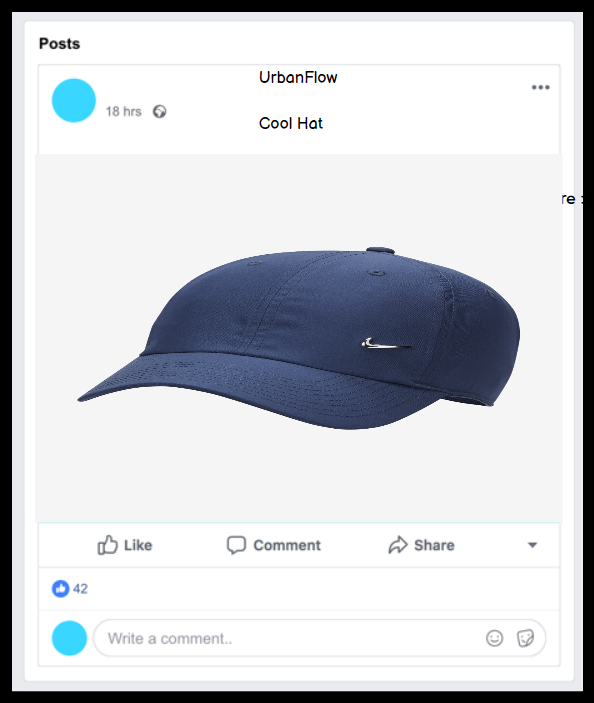
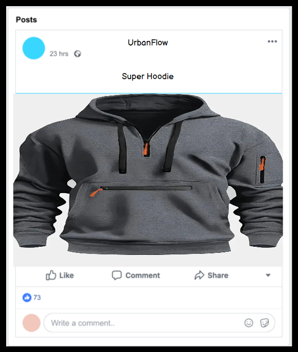

Business Type: B2C E-commerce Online Store

Mission Statement: Urban Flow aims to provide a seamless and enjoyable online shopping experience by offering a curated selection of high-quality urban fashion and lifestyle products. Our mission is to empower individuals to express their unique style and personality through our diverse range of products.

Value Proposition:

Curated Selection: We offer a carefully curated selection of trendy and high-quality urban fashion and lifestyle products.

User Experience: Our user-friendly website ensures a smooth and enjoyable shopping experience.

Customer Service: We prioritize excellent customer service, providing prompt and helpful support to our customers.

Fast Delivery: We offer fast and reliable delivery services to ensure our customers receive their orders promptly.

Revenue Streams:

Product Sales: Revenue generated from the sale of fashion and lifestyle products.

Membership Fees: Optional membership plans offering exclusive discounts and early access to new collections.

Affiliate Marketing: Partnering with influencers and bloggers to promote our products and earn commissions on sales.

Target Market:

Demographics: Urban Flow targets fashion-forward individuals aged 18-35 who are interested in urban fashion and lifestyle products.

Geographics: Primarily focusing on urban areas with a high concentration of young professionals and students.

Psychographics: Customers who value style, quality, and convenience in their shopping experience.

Marketing Strategy:

Social Media Marketing: Utilizing platforms Facebook to reach and engage with our target audience.

By following this business model, Urban Flow aims to establish itself as a leading e-commerce platform for urban fashion and lifestyle products, delivering exceptional value and experience to our customers.
